# Amino Disrespect

Amino Disrespect Gym is dedicated to serving all individuals seeking to join a fitness community and improve their physical and mental well-being.

The website primarily targets new and inexperienced gym-goers, providing them with comprehensive information on how we can assist them in their fitness journey.

In the future, I plan to introduce a member login feature that will offer an enhanced experience, delivering on the promises made on our website.

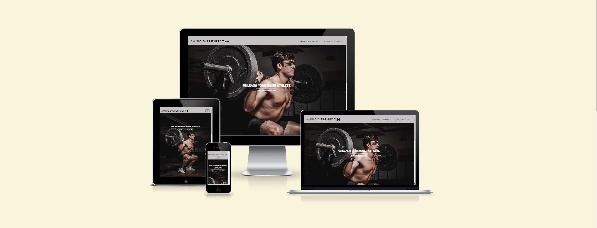

---

## User Experience (UX) & Design

---

### User Stories

- First Time User

  - As a first-time user of the gym website,
    I want to understand the purpose and features of the website,
    So that I can navigate and utilise the platform effectively to meet my fitness goals.

- Returning Visitor

  - As a returning visitor, I want to be able to register my interest to the services provided.

- Website Admin

  - As a website admin for the gym, I want to have a user-friendly interface for managing member registrations, so that I can ensure a smooth user experience.

### Research

Through extensive research on various gyms across the UK, it became evident that a common approach was to exclude "prices" from their websites. Following suit, I have also chosen not to include pricing information. I believe that this approach encourages users to seek consultations, providing an opportunity for the business to establish relationships with users and potentially convert them into new customers.

### Typography

- Google Fonts were used to import the 'Roboto' and 'Poppins' font styles in the style.css file.

### Wireframes

   - [Home](documentation/challenge-wireframe.JPG)
   - [Trainers](documentation/trainer-wireframe.JPG)
   - [30-Day Challenge](documentation/challenge-wireframe.JPG)
   - [Thank You](documentation/thankyou-wireframe.JPG) 

### Built With

- 

- 

- 

- 

- 

- 

- 

---

## Features

---

### Navigation Bar

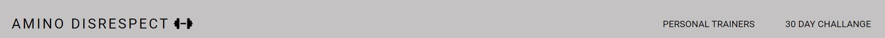

The Navigation bar ensures easy site navigation for users. Its constant presence at the top of the page enables users to quickly access the desired content with just one click. On larger devices, I have enhanced the navigation bar by making it interactive, as demonstrated below.

This image represents hovering over the brand which would take you to the home page

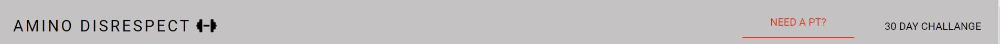

This image represents hovering over the personal trainer which would take you to the trainer page where you will find the information about the trainers.

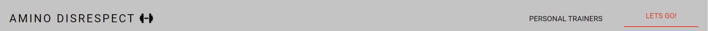

This image represents hovering over the 30 day challenge which would take you to the challenge page where you will find the information on the 30 day challenge.

---

### Footer

The footer is made up of a motivaiton quote along with links to what would be the businesses social media.

---

### Home page

The home page features a captivating full-page image accompanied by a compelling call to action, targeting users who are ready to sign up. The minimalist design approach encourages users to either scroll down or utilize the navigation bar for further exploration.

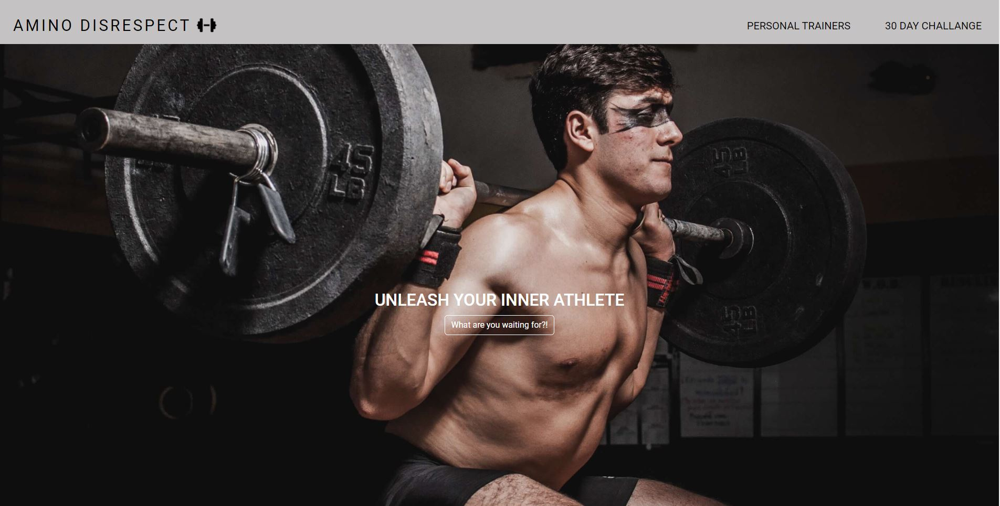

---

### Modal - Interest Form

Upon clicking the button on the home page, a modal window is displayed, allowing users to register their interest in our service.

The implementation of the modal was chosen due to its interactive nature and user-friendly design, which enhances the overall user experience. When using the modal it will take you through to a Thank You page.

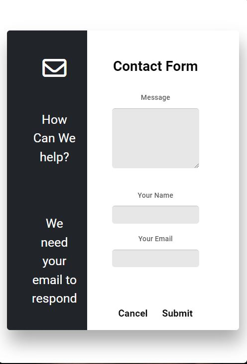

---

### Thank You Page

Registering your interest will bring users to the page where they have the option to leave the site or contuine to browse.

## 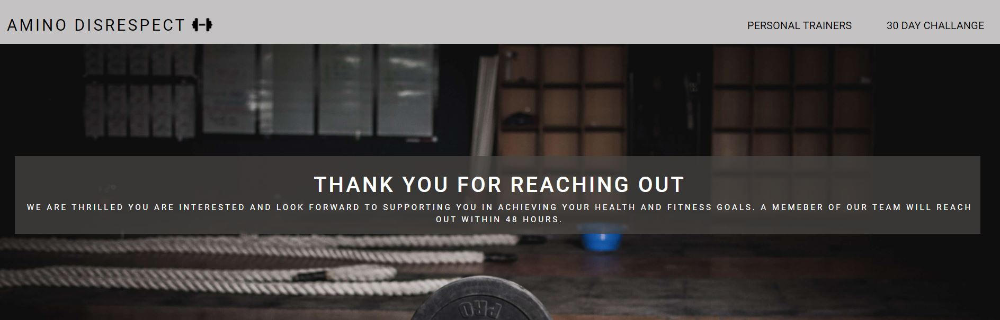

### Personal Trainer

On the Personal Trainer page, users are guided towards individual personal trainers, with each trainer assigned a dedicated button. Clicking on a trainer's button opens a modal window displaying detailed information about the trainer and their areas of specialisation.

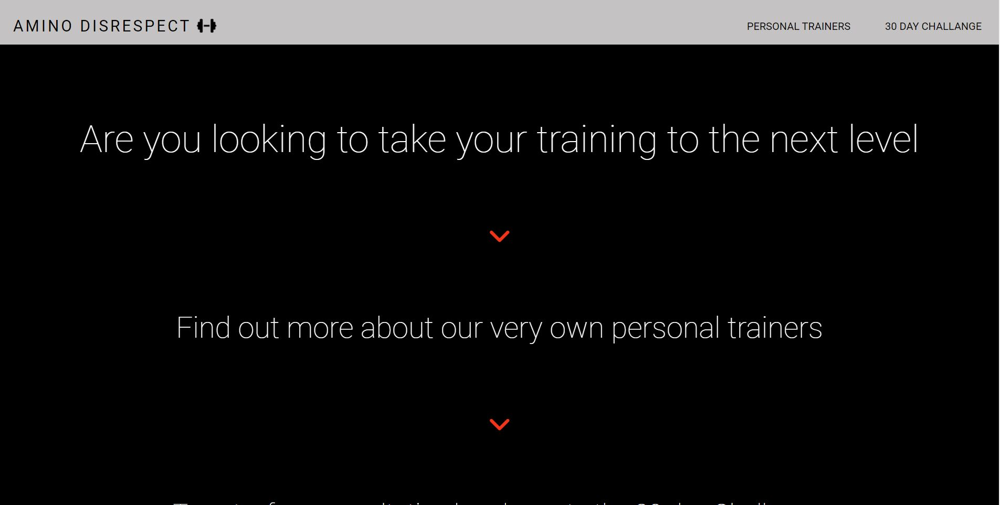

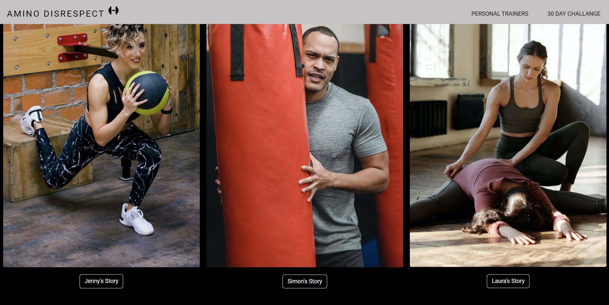

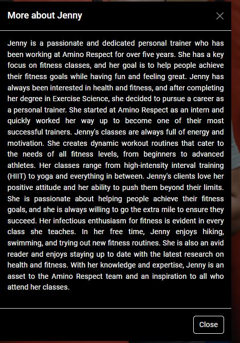

---

### 30 Day Challenge

The 30-Day Challenge page is specifically tailored for users who have followed the intended website flow, starting from the home page to explore the offered services, proceeding to the Personal Trainers page to identify their interests, and finally arriving at the 30-Day Challenge page. The same modal used previously is utilized here for users to register their interest in the challenge. Additionally, an embedded map is included to visually indicate the location.

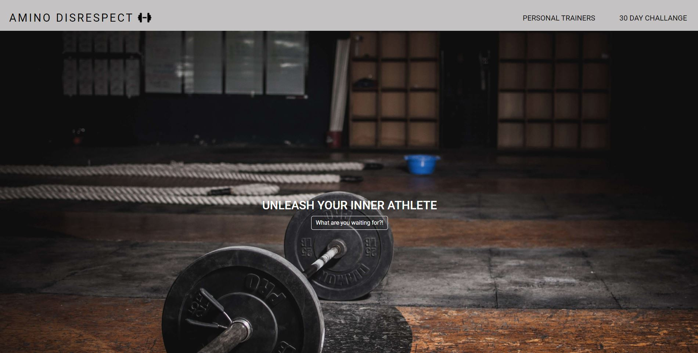

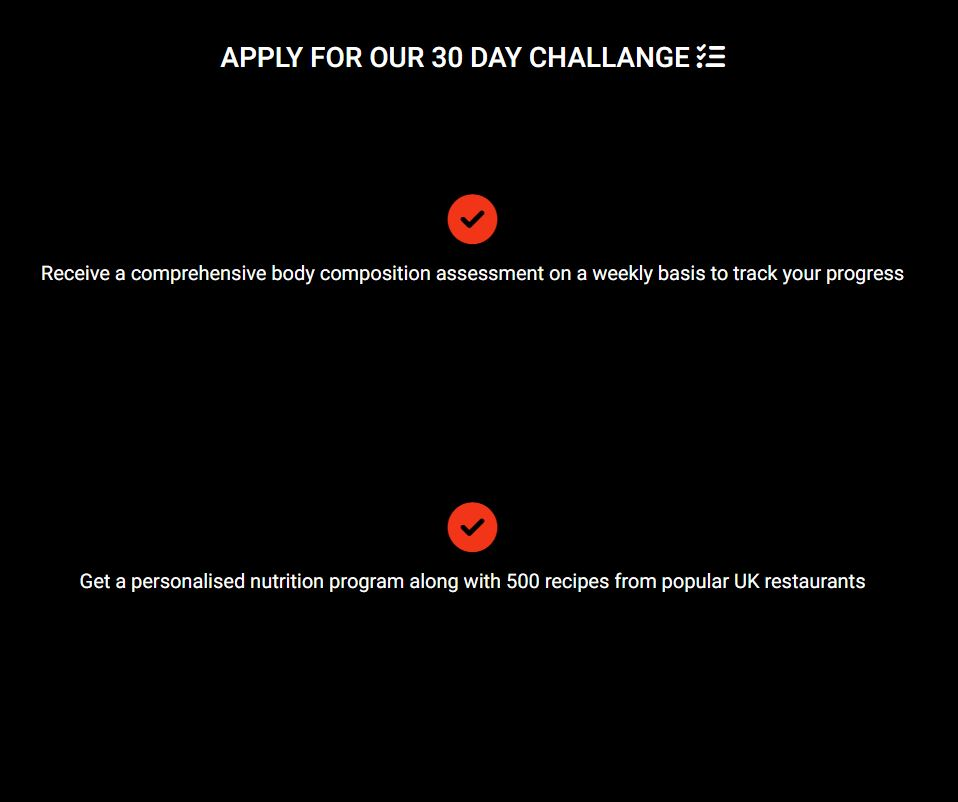

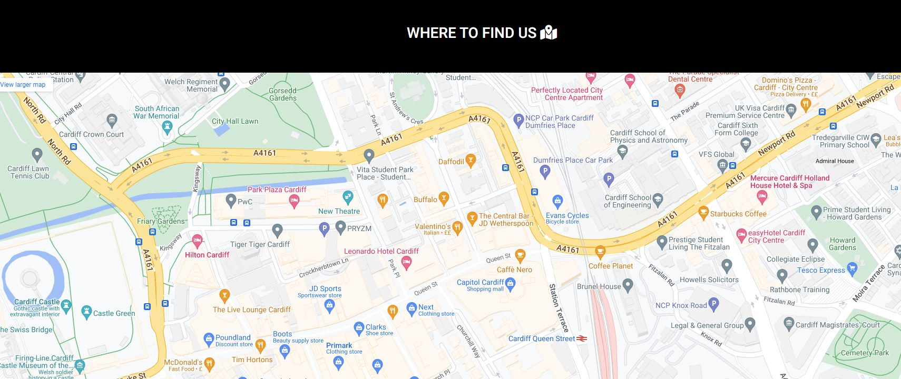

---

## Testing

---

The website has undergone thorough testing across multiple browsers, including Chrome, Firefox, and Edge. Additionally, Chrome's dev tools were utilised to ensure responsiveness across all breakpoints. The testing process also involved checking the website's compatibility on various devices such as Android, iPhone, and iPad.

- Bugs - Whilst testing on devices i identified that the hambuger logo wasnt the correct color on mobile or tablet devices. I wanted to change the color to all black and found out i could do that by manually changing the RBGA values through the URL: as seen below. I fixed this bug by reverting to the inherited color of the toggler.

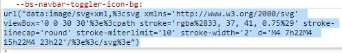

### User Story Tetsing

|User Story|Screenshot|
|---|---|
|**First Time Visitor**|
|As a first time visitor, I want to understand what services i can be offered|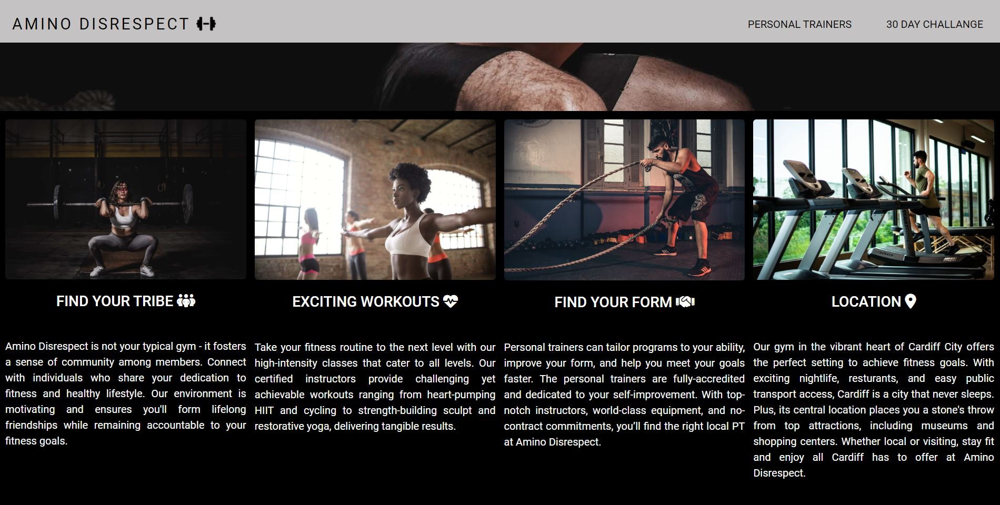|
|As a first time visitor, I want to be able navigate the pages of interest easily. ||
|As a first time visitor, I want to understand who can help me achieve my goals||
|As a first time visitor, I want to see if i can try the service before i sign up||
|**Returning Visitor**|
|As a returning visitor, I want to get in contact with the company||
|As a returning visitor, I want to know the location||
|**Website Administrator**|
|As a website administrator, I would like to update my personal Trainers||
|As a website administrator, I would like users to find it easy to register their interst||

### Validator Testing

- HTML

  - Document checking completed. No errors or warnings to show.

- CSS
  - Document checking completed. No errors or warnings to show.

### Lighthouse Report

| Page      | Device  | Lighthouse Results                                      | Comments                                                                                                                                                                                    |
| --------- | ------- | ------------------------------------------------------- | ------------------------------------------------------------------------------------------------------------------------------------------------------------------------------------------- |
| Index     | Desktop | 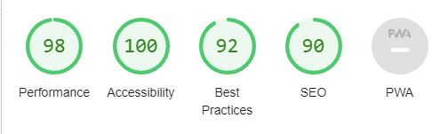       |                                                                                                                                                                                             |
| Index     | Mobile  | 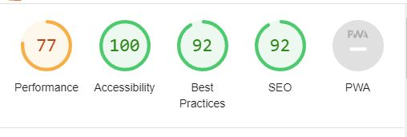         | Next-gen image formatting needed to increase performance.                                                                                                                                   |
| Trainer   | Desktop | 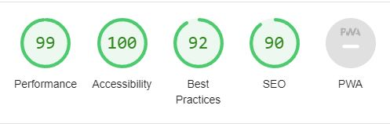   |                                                                                                                                                                                             |
| Trainer   | Mobile  | 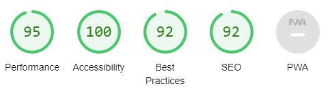    |                                                                                                                                                                                             |
| Challenge | Desktop | 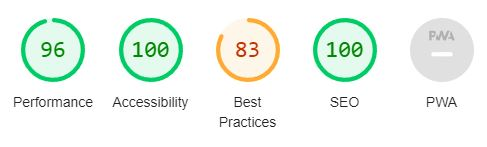 | spoke with mentor about "best practice". He believes this to be through fault of bootstrap not through anything wrong with website                                                          |
| Challenge | Mobile  | 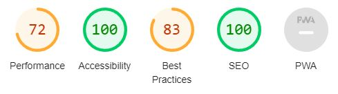  | Next-gen image formatting needed to increase performance. I Spoke with mentor about "best practice. He believes this to be through fault of bootstrap not through anything wrong with website |

### Manual Testing

Here is a table of the manual testing done on the site to determine if all features work as described and designed:

|Feature Tested|Required Action|Expected Outcome|Result|
|---|---|---|---|
|Amino Disrespect (all pages)|Left-click |This should direct the user to the homepage|Homepage successfully loads|
|Personal Trainer Link (all pages)|Left-click|This should direct the user to trainer.html page |Trainer Page successfully loads|
|30 day challenge link (all pages)|Left-click|This should direct the user to challenge.html|Challenge page successfully loads|
|Modal button (what are you waiting for?!) |Left-click|This should pop up a modal with an interest form| Modal successfully loads|
|Form (modal pop up) |Enter details |This should not allow you to submit unless required fields completed| Submit without entered details will ask you to complete the required fields|
|Social Media Icons (all pages)|Left-click |This should load social media pages|social media homepages load|

---

### Responsiveness 

---

This project is designed to be fully responsive, ensuring a seamless user experience across various devices and screen sizes. The layout and elements of the application dynamically adjust to provide optimal viewing and interaction on desktops, laptops, tablets, and mobile devices.

By utilising responsive design techniques such as grids, flexible images, and media queries, the project is able to adapt its appearance and functionality. I

Throughout the development process, extensive testing was conducted on different browsers and devices to ensure consistent and reliable responsiveness. The project's responsive design aims to provide a consistent look and feel, making it accessible and visually appealing to users regardless of their chosen platform.

---
## Deployment
---
### How the site was deployed

- The site was deployed to GitHub pages. The steps to deploy are as follows:
- In the GitHub repository, navigate to the Settings tab
- From the source section drop-down menu, select the Master Branch
- Once the master branch has been selected, click on save and the page will be automatically refreshed with a detailed ribbon display to indicate the successful deployment.
- The live link can be found here - https://joshmez1.github.io/Gym-Project/

---

## Credits & Acknowledgements

---

### Content

- [Bbbootstrap](https://bbbootstrap.com/snippets/bootstrap-5-simple-contact-us-form-modal-23624221) for Modal ideas 
- [Bootstrap](https://bootstrap.com/) for grid layouts
- [Font Awesome](https://fontawesome.com/) for icons
- Loving running project code used for thank you page

### Media
- Images were taken from [Pexels](https://www.pexels.com/).

### People

- Thank you to my mentor Chris Quinn for his support during my project

